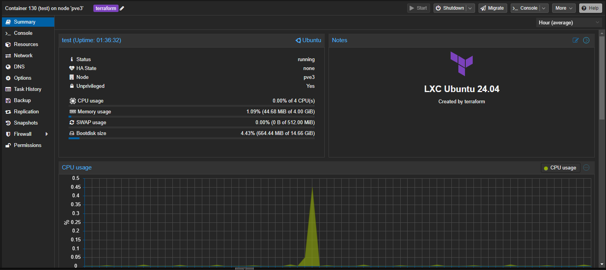

# Terraform Proxmox LXC 

Example of a simple LXC creation in proxmox using terraform



- Provider - [terraform-provider-proxmox](https://registry.terraform.io/providers/Telmate/proxmox/latest/docs/resources/lxc)
- Github - [Telmate/terraform-provider-proxmox](https://github.com/Telmate/terraform-provider-proxmox)
- [Docs](https://github.com/Telmate/terraform-provider-proxmox/blob/master/docs/index.md)


## Prepare

### Proxmox create user and configuring permissions
Create Role
```bash
pveum role add TerraformProv -privs "Datastore.AllocateSpace Datastore.Audit Pool.Allocate Sys.Audit Sys.Console Sys.Modify VM.Allocate VM.Audit VM.Clone VM.Config.CDROM VM.Config.Cloudinit VM.Config.CPU VM.Config.Disk VM.Config.HWType VM.Config.Memory VM.Config.Network VM.Config.Options VM.Migrate VM.Monitor VM.PowerMgmt SDN.Use"
```

Create User
- note the command balks at special characters in the terminal
- ended up resetting to strong password via GUI
```bash
pveum user add terraform-prov@pve --password <password>
```

Associate Role & User
```bash
pveum aclmod / -user terraform-prov@pve -role TerraformProv
```

Additional information: [Proxmox: Deploying Infrastructure with Terraform](https://ronamosa.io/docs/engineer/LAB/proxmox-terraform/)

### Change settings

All the basic settings LXC in the file [`vars.auto.tfvars`](https://github.com/akmalovaa/terraform-proxmox-lxc/blob/main/vars.auto.tfvars)

export env variables for connect proxmox:
```conf
TF_VAR_proxmox_api_url = https://10.0.0.2:8006/api2/json
TF_VAR_pm_user = terraform-prov@pve
TF_VAR_pm_password = 12345
```

### Network
It is more convenient for me when the VMID corresponds to the IP address of the LXC, you can change the network settings in the file `main.tf`


## Run 

```shell
terraform init
terraform plan
terraform apply
```

### Taskfile

`Taskfile.yaml`

If you have docker and taskfile installed locally, I have prepared a script to run terraform in a container (uses the `.env` file for variables, rename `.env.example`)

Run temporary container terraform and passthrough current directory

```shell
task shell
cd srv
```


### Debug variables

PowerShell
```powershell
$env:TF_LOG="TRACE"
$env:TF_LOG_PATH="terraform.txt"
```

Linux
```bash
export TF_LOG="TRACE"
export TF_LOG_PATH="terraform.txt"
```


### Commands 
Auto approve

```shell
terraform apply -auto-approve
```